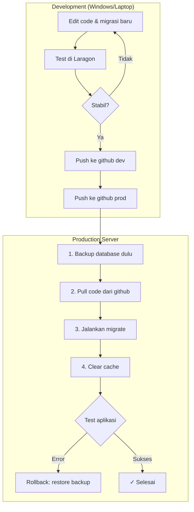

# Master Data KPI - Safe Deployment Workflow

## Overview Masalah Utama

| Masalah | Penyebab | Solusi |
|---------|----------|--------|
| Database production terhapus | `migrate:fresh` atau `docker compose down -v` | **JANGAN** pakai `migrate:fresh`, gunakan `migrate` saja |
| .env perlu setting ulang | `.env` tidak di-commit ke git | Simpan `.env.production` terpisah |
| vendor/public hilang | `docker compose down` atau rebuild | Gunakan volume persistent |
| Struktur DB conflict | Migrasi baru vs DB lama | Jalankan `migrate` (bukan `fresh`) |

---

## Aturan Emas Deployment

> [!CAUTION]
> **JANGAN PERNAH** jalankan command ini di production:
> - `php artisan migrate:fresh` ❌ (menghapus SEMUA data)
> - `php artisan migrate:refresh` ❌ (rollback lalu migrate ulang)
> - `docker compose down -v` ❌ (flag `-v` menghapus volume/database)

> [!TIP]
> **SELALU** gunakan:
> - `php artisan migrate` ✅ (hanya jalankan migrasi baru)
> - `docker compose down` ✅ (tanpa `-v`)
> - `docker compose up -d` ✅

---

## Workflow Deployment Aman



---

## Step-by-Step Deployment

### SEBELUM Update (Di Windows)

```powershell
# 1. Backup database production ke lokal (opsional tapi disarankan)
cd C:\laragon\www\masterdataKPI
# Jalankan mysqldump via docker atau tool lain jika memungkinkan

# 2. Push ke github prod
git add -A
git commit -m "feat: deskripsi perubahan"
git push prod main
```

### DI SERVER (Via SSH)

```bash
# 1. SSH ke server
ssh peroniks@peroniks-ppicserver

# 2. Masuk ke folder project
cd /srv/docker/apps/masterdataKPI

# 3. BACKUP database SEBELUM update (WAJIB!)
docker exec masterdatakpi-db mysqldump -u root -p[PASSWORD] masterdata_kpi > ~/backups/backup_before_update_$(date +%Y%m%d_%H%M%S).sql

# 4. Pull code terbaru
git pull origin main

# 5. Masuk ke container PHP dan jalankan migrasi (HANYA jika ada migration baru)
docker exec -it masterdatakpi-app php artisan migrate

# 6. Clear semua cache
docker exec -it masterdatakpi-app php artisan config:clear
docker exec -it masterdatakpi-app php artisan cache:clear
docker exec -it masterdatakpi-app php artisan view:clear
docker exec -it masterdatakpi-app php artisan route:clear

# 7. Jika ada perubahan di composer.json
docker exec -it masterdatakpi-app composer install --no-dev --optimize-autoloader

# 8. Jika ada perubahan di package.json / vite
docker exec -it masterdatakpi-app npm install
docker exec -it masterdatakpi-app npm run build

# 9. Test aplikasi di browser
```

### JIKA ERROR - Rollback

```bash
# Restore database dari backup
docker exec -i masterdatakpi-db mysql -u root -p[PASSWORD] masterdata_kpi < ~/backups/backup_before_update_XXXXXXXX_XXXXXX.sql

# Rollback code ke commit sebelumnya
git reset --hard HEAD~1
# atau ke commit tertentu
git reset --hard <commit_hash>
```

---

## Struktur File yang TIDAK boleh di-commit

Buat file-file ini di server dan jangan pernah overwrite:

```
/srv/docker/apps/masterdataKPI/
├── .env                    # Jangan commit, buat manual di server
├── docker-compose.yml      # Commit, tapi jangan sering ubah
├── storage/                # Jangan commit isinya
│   ├── app/
│   ├── framework/
│   └── logs/
└── public/storage -> ../storage/app/public  # Symlink
```

---

## Backup .env Production

Simpan copy `.env` production di tempat aman (bukan di git):

```bash
# Di server, backup .env ke home directory
mkdir -p ~/env_backups
cp /srv/docker/apps/masterdataKPI/.env ~/env_backups/masterdataKPI.env.backup

# Atau download ke Windows
scp peroniks@peroniks-ppicserver:/srv/docker/apps/masterdataKPI/.env C:\laragon\www\masterdataKPI\backups\.env.production
```

---

## Tips Migrasi Database

### 1. Gunakan Migrasi yang Idempotent

Migrasi yang aman adalah yang mengecek dulu sebelum eksekusi:

```php
// Contoh migrasi aman
public function up()
{
    // Cek apakah kolom sudah ada
    if (!Schema::hasColumn('users', 'new_column')) {
        Schema::table('users', function (Blueprint $table) {
            $table->string('new_column')->nullable();
        });
    }
}
```

### 2. Jangan Pernah Modify Migrasi Lama

Jika perlu ubah struktur, buat migrasi BARU:

```bash
# SALAH: Edit file migrasi lama
# BENAR: Buat migrasi baru
php artisan make:migration add_new_column_to_users_table
```

### 3. Test Migrasi di Lokal Dulu

Sebelum push ke prod, test migrasi dengan data dari production di Laragon:

```powershell
# 1. Restore dari production ke lokal
# 2. Jalankan migrasi baru
php artisan migrate
# 3. Test aplikasi
```

---

## Checklist Deployment

```markdown
## Pre-Deployment
- [ ] Semua fitur sudah di-test di Laragon
- [ ] Semua migrasi sudah di-test di Laragon dengan data production
- [ ] Code sudah di-push ke github dev
- [ ] Code sudah di-push ke github prod

## Deployment
- [ ] SSH ke server (peroniks-ppicserver)
- [ ] Backup database di server (sebelum pull)
- [ ] `git pull origin main`
- [ ] `php artisan migrate` (BUKAN migrate:fresh!)
- [ ] Clear cache (config, cache, view, route)
- [ ] Test aplikasi di browser

## Post-Deployment
- [ ] Verifikasi semua fitur baru berfungsi
- [ ] Verifikasi data lama masih ada
- [ ] Hapus backup lama jika sudah stabil (setelah 1-2 hari)
```

---

## Docker Compose Best Practices

### Jangan Sampai Volume Terhapus

```yaml
# docker-compose.yml
volumes:
  db_data:  # Named volume - JANGAN hapus dengan down -v

services:
  db:
    image: mysql:8.0
    volumes:
      - db_data:/var/lib/mysql  # Data persistent
    
  app:
    volumes:
      - ./storage:/var/www/storage  # Bind mount untuk storage
```

### Perintah Docker yang Aman

```bash
# AMAN - Stop dan remove containers, network tetap
docker compose down

# AMAN - Rebuild tanpa hapus volume
docker compose up -d --build

# BERBAHAYA - Hapus SEMUA termasuk volume (database ikut hilang!)
docker compose down -v  # ❌ JANGAN di production!
```
